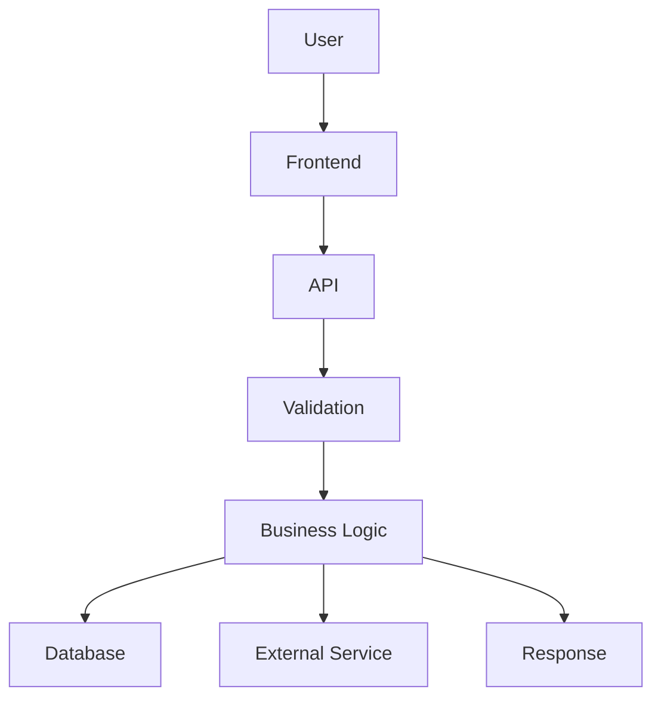

# Output formats

Before creating anything, ask: **"Will a file actually help the human understand this better than a chat reply would?"** If not, don't create one. If a Markdown file is enough, don't reach for HTML. If a diagram explains it, that's the whole artifact — it doesn't need a report wrapped around it too.

Prefer **small + useful + memorable** over **large + complete + unread**.

## 1. Quick answer (no file) — default choice

Use for most requests: a single function, a small change, a specific question. Just answer in chat, plainly. Include the important flow, the relevant rule, and anything to remember, in a few sentences or a short list.

## 2. Markdown report

Use when the information is mostly explanation, rules, relationships, or a before/after story that's too long for chat — and the human will likely want to come back to it.

Filename convention:
- `CODEBASE-UNDERSTANDING.md` for a general "explain this" / before-change deep dive
- `CHANGE-UNDERSTANDING.md` for an after-change review

Skeleton:

```markdown
# <Area / Feature / Change> — Understanding

## What was investigated
<scope, and what was and wasn't looked at>

## Simple explanation
<what it does, in plain words>

## Important flow
<the main path through the code — a Mermaid diagram if it helps>

## Business rules
<the rules that must keep holding true>

## Key decisions and why
<what evidence backs each "why" — or "can't confirm" where it doesn't>

## Risks / edge cases
<what could go wrong, and under what conditions>

## What changed (if applicable)
<old vs new, and anything that may have quietly broken>

## Remember This
- <short, concrete, memorable facts — see the memory card format below>

## You should understand these before moving on
1. ...
2. ...
```

Leave out sections that don't apply — don't pad the template just to fill it.

## 3. HTML report

Use only when the area is genuinely complex and a visual structure — architecture, several related flows, side-by-side before/after — would meaningfully beat plain text. This is the exception, not the default.

Keep it a single self-contained file: inline `<style>`, no build step, no external dependencies except Mermaid if a diagram is included (load it from a CDN `<script>` tag). Use `<details>`/`<summary>` for collapsible sections instead of custom JS where possible.

Minimal skeleton:

```html
<!DOCTYPE html>
<html lang="en">
<head>
<meta charset="UTF-8">
<title>Change Understanding</title>
<style>
  body { font-family: system-ui, sans-serif; max-width: 900px; margin: 2rem auto; line-height: 1.5; }
  .remember { background: #fff8e1; border-left: 4px solid #f5a623; padding: 1rem; }
  .risk { background: #ffecec; border-left: 4px solid #d33; padding: 1rem; }
  details { border: 1px solid #ddd; border-radius: 6px; padding: 0.5rem 1rem; margin: 0.5rem 0; }
  summary { cursor: pointer; font-weight: 600; }
</style>
<script src="https://cdn.jsdelivr.net/npm/mermaid/dist/mermaid.min.js"></script>
<script>mermaid.initialize({ startOnLoad: true });</script>
</head>
<body>
  <h1>Change Understanding: &lt;area&gt;</h1>

  <details open><summary>Simple explanation</summary><p>...</p></details>
  <details><summary>Main flow</summary><pre class="mermaid">graph TD; A-->B;</pre></details>
  <details><summary>Business rules</summary><ul><li>...</li></ul></details>
  <details><summary>Before vs after</summary><p>...</p></details>

  <div class="risk"><strong>Risk:</strong> ...</div>
  <div class="remember"><strong>Remember this:</strong> ...</div>
</body>
</html>
```

The goal is not a beautiful website. Use just enough structure that the human can scan it and expand only what they need.

## 4. Flow diagram

Use when the main problem is understanding a *process* — a request moving through a system, or one flow end to end. Prefer Mermaid: it's plain text, stays in version control, and the human can edit it later.



A diagram can be the entire artifact — it doesn't need a report around it unless there's real explanation that won't fit as labels.

## 5. Before/change/after comparison

Use for any after-change review where behavior actually moved. This block can live inline in chat or inside a Markdown/HTML report — it doesn't need its own file.

```text
BEFORE
How it worked: <plain description>

    ↓

CHANGE
What changed: <plain description>

    ↓

AFTER
How it works now: <plain description>

    ↓

IMPACT
What else is affected: <callers, workflows, edge cases>
```

## 6. Memory card ("Remember This")

Use for any complex area, regardless of which other formats are used. This is often the single most valuable thing produced — keep it short.

```markdown
## Remember This

- Payment status is controlled by the backend.
- The frontend only displays the status.
- All payment updates go through PaymentService.
- Do not update payment status directly from the UI.
- Failed payments can still have a transaction record.
```

Five bullets or fewer, ideally. If it's longer than that, it's not a memory card anymore — it's a report, and the important parts will get lost.
