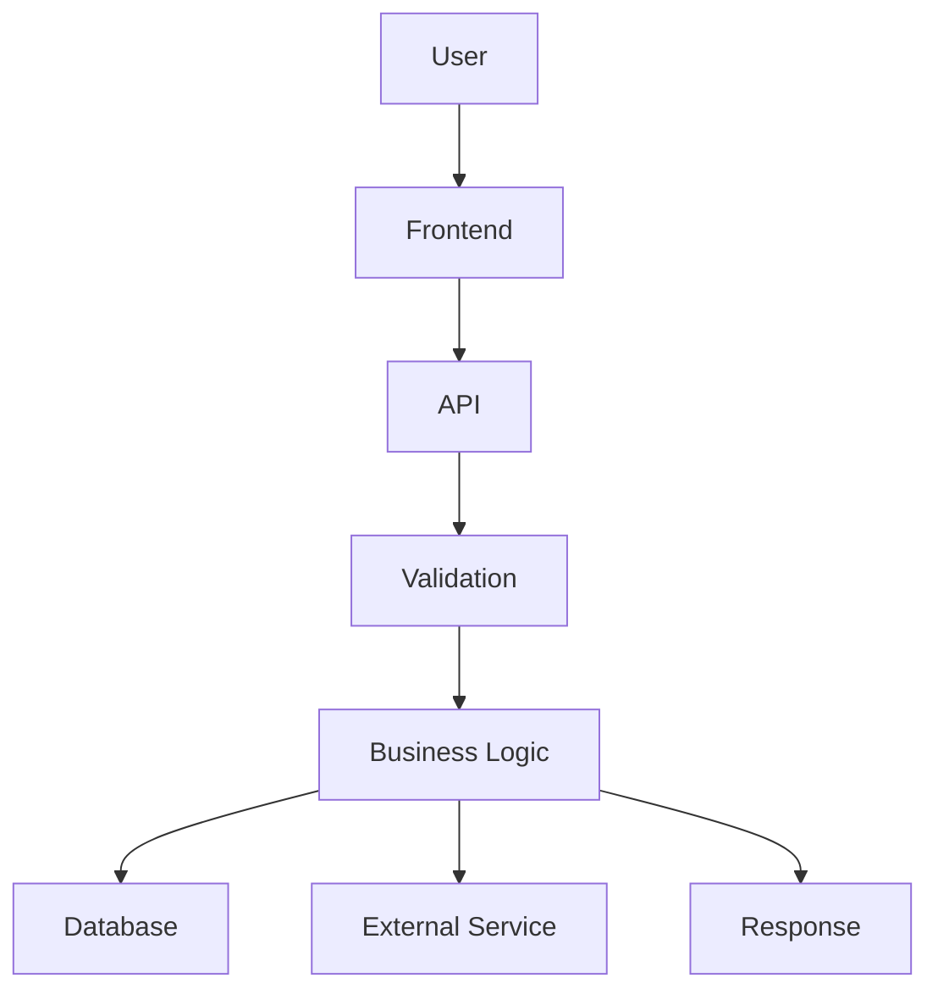

# Output formats

Before creating anything, ask: **"Will a file actually help the human understand this better than a chat reply would?"** If not, don't create one. If a Markdown file is enough, don't reach for HTML. If a diagram explains it, that's the whole artifact — it doesn't need a report wrapped around it too.

Prefer **small + useful + memorable** over **large + complete + unread**.

## Scale to the size of the ask

Don't run the full process on every request. Match the depth to what's actually at stake.

**Small request** (one function, a small change, a simple question):
```
Simple explanation
+ Important flow
+ One or two things to remember
```

**Medium request** (a feature, a module, a normal change):
```
Explanation
+ Flow
+ Rules
+ Risks
+ Memory
+ Ownership questions (if something is genuinely easy to get wrong)
```

**Large or risky change** (money, auth, shared code, a rewrite):
```
Scope
+ Architecture / mental map
+ Main flows
+ Business rules
+ Decisions and why (Decision Memory where it matters)
+ Normal / failure / edge scenarios
+ Before / after, and whether AI changed more than was asked
+ Impact (what else is affected)
+ Risks, and what's still unknown
+ Memory
+ Full human ownership check, explain-it-back for the core flow
```

Go deeper only because the code or the change actually needs it — not because the template has more boxes to fill.

## 1. Quick answer (no file) — default choice

Use for most requests. Just answer in chat, plainly. Include the important flow, the relevant rule, and anything to remember, in a few sentences or a short list.

## 2. Markdown report

Use when the information is mostly explanation, rules, relationships, or a before/after story that's too long for chat — and the human will likely want to come back to it.

Filename convention, pick the one that matches the request:
- `CODEBASE-UNDERSTANDING.md` — general "explain this area" / before-change deep dive
- `CHANGE-UNDERSTANDING.md` — after-change review
- `FEATURE-UNDERSTANDING.md` — one feature, entry point to result
- `FLOW-UNDERSTANDING.md` — one specific process traced end to end

Skeleton (use the [Final Answer Structure](#final-answer-structure) headings, omitting whatever doesn't apply):

```markdown
# <Area / Feature / Change> — Understanding

## What I Looked At
## Simple Understanding
## Mental Map / Main Flow
## Important Rules
## Why These Decisions Exist
## Normal / Failure / Edge Scenarios
## What Could Go Wrong
## What Changed
## What Is Easy to Miss
## Still Unknown
## Remember This
## You Should Understand These Before Moving On
## Can I Own This?
```

## 3. HTML report

Use only when the area is genuinely complex and visual structure — architecture, several related flows, side-by-side before/after — would meaningfully beat plain text. This is the exception, not the default.

Keep it a single self-contained file: inline `<style>`, no build step, no external dependencies except Mermaid if a diagram is included (load it from a CDN `<script>` tag). Use `<details>`/`<summary>` for collapsible sections instead of custom JS where possible.

Minimal skeleton:

```html
<!DOCTYPE html>
<html lang="en">
<head>
<meta charset="UTF-8">
<title>Change Understanding</title>
<style>
  body { font-family: system-ui, sans-serif; max-width: 900px; margin: 2rem auto; line-height: 1.5; }
  .remember { background: #fff8e1; border-left: 4px solid #f5a623; padding: 1rem; }
  .risk { background: #ffecec; border-left: 4px solid #d33; padding: 1rem; }
  details { border: 1px solid #ddd; border-radius: 6px; padding: 0.5rem 1rem; margin: 0.5rem 0; }
  summary { cursor: pointer; font-weight: 600; }
</style>
<script src="https://cdn.jsdelivr.net/npm/mermaid/dist/mermaid.min.js"></script>
<script>mermaid.initialize({ startOnLoad: true });</script>
</head>
<body>
  <h1>Change Understanding: &lt;area&gt;</h1>

  <details open><summary>Simple explanation</summary><p>...</p></details>
  <details><summary>Main flow</summary><pre class="mermaid">graph TD; A-->B;</pre></details>
  <details><summary>Business rules</summary><ul><li>...</li></ul></details>
  <details><summary>Before vs after</summary><p>...</p></details>

  <div class="risk"><strong>Risk:</strong> ...</div>
  <div class="remember"><strong>Remember this:</strong> ...</div>
</body>
</html>
```

The goal is not a beautiful website. Use just enough structure that the human can scan it and expand only what they need.

## 4. Flow diagram

Use when the main problem is understanding a *process* — a request moving through a system, or one flow end to end. Prefer Mermaid: it's plain text, stays in version control, and the human can edit it later.



A diagram can be the entire artifact — it doesn't need a report around it unless there's real explanation that won't fit as labels.

## 5. Before/change/after comparison

Use for any after-change review where behavior actually moved. This block can live inline in chat or inside a Markdown/HTML report — it doesn't need its own file.

```text
BEFORE
How it worked: <plain description>

    ↓

CHANGE
What changed: <plain description>

    ↓

AFTER
How it works now: <plain description>

    ↓

IMPACT
What else is affected: <callers, workflows, edge cases>
```

## 6. Memory card ("Remember This")

Use for any complex area, regardless of which other formats are used. Often the single most valuable thing produced — keep it to five bullets or fewer (see [human-ownership.md](human-ownership.md)).

```markdown
## Remember This

- Payment status is controlled by the backend.
- The frontend only displays the status.
- All payment updates go through PaymentService.
- Do not update payment status directly from the UI.
- Failed payments can still have a transaction record.
```

## 7. Memory document (rare — long-lived areas only)

For an area the human will keep coming back to over weeks or months — not for a one-off task — a standing memory document can be worth creating:

```text
CODEBASE-MEMORY.md
```

Contents: architecture, important rules, important flows, dangerous areas, important decisions (with evidence), easy-to-forget facts. Update it rather than recreating it once it exists. Do not create this for a small or one-time task — it earns its place only when the human is clearly going to live in this area for a long time.

## Final Answer Structure

When a detailed response is warranted, use this order and skip whatever doesn't apply:

```
## What I Looked At
## Simple Understanding
## Mental Map / Main Flow
## Important Rules
## Why These Decisions Exist
## Normal / Failure / Edge Scenarios
## What Could Go Wrong
## What Changed                              (if applicable)
## What Is Easy to Miss
## Still Unknown                             (if relevant)
## Remember This
## You Should Understand These Before Moving On
## Can I Own This?
```

Never include an empty section. Never stretch a small answer to fill the template.
